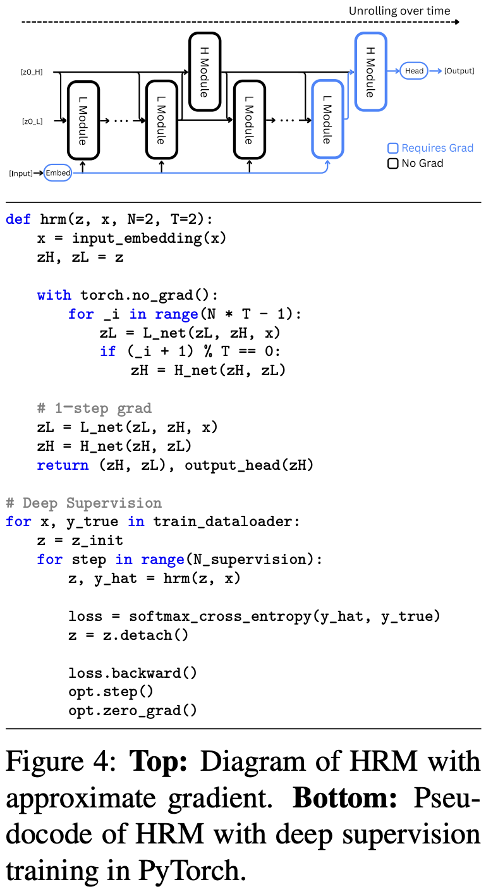

</img>

## Hierarchical Reasoning Model (wip)

### Install

```bash
$ pip install HRM-pytorch
```

### Usage

```python
import torch
from HRM import HRM

hrm = HRM(
    networks = [
        dict(
            dim = 32,
            depth = 2,
            attn_dim_head = 8,
            heads = 1,
            use_rmsnorm = True,
            rotary_pos_emb = True,
            pre_norm = False
        ),
        dict(
            dim = 32,
            depth = 4,
            attn_dim_head = 8,
            heads = 1,
            use_rmsnorm = True,
            rotary_pos_emb = True,
            pre_norm = False
        )
    ],
    num_tokens = 256,
    dim = 32,
    reasoning_steps = 10
)

seq = torch.randint(0, 256, (3, 1024))
labels = torch.randint(0, 256, (3, 1024))

loss, hiddens, _ = hrm(seq, labels = labels)
loss.backward()

loss, hiddens, _ = hrm(seq, hiddens = hiddens, labels = labels)
loss.backward()

# after much training

pred = hrm(seq, reasoning_steps = 5)
```

## Citations

```bibtex
@misc{wang2025hierarchicalreasoningmodel,
    title   = {Hierarchical Reasoning Model},
    author  = {Guan Wang and Jin Li and Yuhao Sun and Xing Chen and Changling Liu and Yue Wu and Meng Lu and Sen Song and Yasin Abbasi Yadkori},
    year    = {2025},
    eprint  = {2506.21734},
    archivePrefix = {arXiv},
    primaryClass = {cs.AI},
    url     = {https://arxiv.org/abs/2506.21734},
}
```
